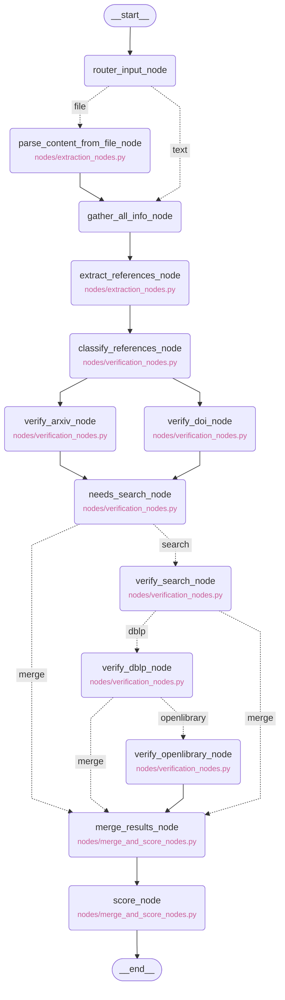

# citeguard

LLM hallucination detection pipeline for verifying bibliographic references. Built with LangGraph and FastAPI.

## Prerequisites

### Python & uv

- Python 3.11+
- [uv](https://docs.astral.sh/uv/getting-started/installation/) — fast Python package manager

### Langfuse (Observability)

Citeguard uses [Langfuse](https://langfuse.com) for tracing and observability of agent runs. You have two options:

**Option A: Langfuse Cloud (recommended for quick setup)**

1. Create a free account at [cloud.langfuse.com](https://cloud.langfuse.com)
2. Go to **Settings → API Keys** and create a new key pair
3. Copy your `Secret Key`, `Public Key`, and note the base URL (`https://cloud.langfuse.com`)

**Option B: Self-hosted Langfuse (via Docker)**

If you prefer to run Langfuse locally:

```bash
# Clone and start Langfuse
git clone https://github.com/langfuse/langfuse.git
cd langfuse
docker compose up -d
```

Langfuse will be available at `http://localhost:3000`. Create a project and generate API keys from the UI.

> For more details, see the [Langfuse self-hosting docs](https://langfuse.com/docs/deployment/self-host).

## Installation

1. Clone and enter the repo directory:
    ```bash
    git clone https://github.com/your-org/citeguard.git
    cd citeguard
    ```

2. Create and activate a virtual environment:
    ```bash
    uv sync
    source .venv/bin/activate
    ```

3. Set up your environment variables:
    ```bash
    cp .env.example .env
    ```
    Then open `.env` and fill in your keys.

**Optional — DBLP local database:**

For better CS conference paper coverage, build a local DBLP index (~4.6GB, runs once):

```bash
uv run python scripts/build_dblp_index.py
```

This downloads the full DBLP dataset and indexes it locally. After building, set:
```
DBLP_DB_PATH=./data/dblp/dblp.db
```

**Optional — Web search fallback:**

For references that all academic databases fail to find, you can enable a last-resort web search stage. Set **one** of the following in your `.env`:

| Option | Setup | Cost | Notes |
|---|---|---|---|
| **SearXNG** | Docker (self-hosted) | Free | Best academic coverage — targets Google Scholar, Semantic Scholar, arXiv |
| **Tavily** | API key | Free tier (1k req/month) | No infrastructure needed — sign up at [tavily.com](https://tavily.com) |

If neither is set, the pipeline skips this stage silently — no breakage.

**SearXNG setup (one command):**

```bash
docker compose -f docker/searxng/docker-compose.yml up -d
```

Then add to `.env`:
```
SEARXNG_URL=http://localhost:8080
```

**Tavily setup:**

```
TAVILY_API_KEY=tvly-xxxxxxxxxx
```

> Web search results are intentionally scored as `LIKELY_REAL` at best — never `VERIFIED` — reflecting the weaker signal from a general web match compared to a structured academic database lookup.

## Usage

```bash
# Development
uv run uvicorn app.main:app --reload
```

The API will be available at `http://localhost:8000`. Visit `/docs` for the interactive Swagger UI.

## Docker Build

```bash
docker build -t citeguard --platform linux/amd64 .
```

```bash
docker run --env-file .env -p 8000:8000 citeguard
```

## How It Works

Citeguard runs a multi-agent pipeline (via LangGraph) that:

<!-- PIPELINE_MERMAID_START -->

<!-- PIPELINE_MERMAID_END -->

1. **Extracts** structured references from LLM-generated text
2. **Verifies** each reference against scholarly databases (Crossref, Semantic Scholar, OpenAlex)
3. **Cross-validates** metadata fields (authors, year, journal, DOI)
4. **Scores** each reference as verified, suspicious, or hallucinated

All runs are traced in Langfuse for full observability.

 
## API Usage
 
Submit text for verification:
 
```bash
curl -X POST http://localhost:8000/verify \
  -H "Authorization: Bearer your-token" \
  -H "Content-Type: application/json" \
  -d '{"text": "your text with references here", "content_type": "text"}'
```
 
Upload a file:
 
```bash
curl -X POST http://localhost:8000/verify \
  -H "Authorization: Bearer your-token" \
  -F "file=@paper.pdf"
```
 
Example response:
 
```json
{
  "total": 16,
  "verified": 10,
  "needs_review": 1,
  "likely_hallucinated": 2,
  "unverifiable": 3,
  "references": [
    {
      "title": "Attention is all you need",
      "verdict": "VERIFIED",
      "matched_url": "https://arxiv.org/abs/1706.03762",
      "sources_checked": ["arxiv"]
    }
  ]
}
```
 
---

## Terms of Use

**citeguard** is licensed under the [MIT License](./LICENSE).