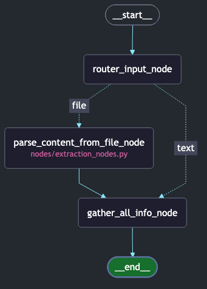

# citeguard

LLM hallucination detection pipeline for verifying bibliographic references. Built with LangGraph and FastAPI.

## Prerequisites

### Python & uv

- Python 3.11+
- [uv](https://docs.astral.sh/uv/getting-started/installation/) — fast Python package manager

### Langfuse (Observability)

Citeguard uses [Langfuse](https://langfuse.com) for tracing and observability of agent runs. You have two options:

**Option A: Langfuse Cloud (recommended for quick setup)**

1. Create a free account at [cloud.langfuse.com](https://cloud.langfuse.com)
2. Go to **Settings → API Keys** and create a new key pair
3. Copy your `Secret Key`, `Public Key`, and note the base URL (`https://cloud.langfuse.com`)

**Option B: Self-hosted Langfuse (via Docker)**

If you prefer to run Langfuse locally:

```bash
# Clone and start Langfuse
git clone https://github.com/langfuse/langfuse.git
cd langfuse
docker compose up -d
```

Langfuse will be available at `http://localhost:3000`. Create a project and generate API keys from the UI.

> For more details, see the [Langfuse self-hosting docs](https://langfuse.com/docs/deployment/self-host).

## Installation

1. Clone and enter the repo directory:
    ```bash
    git clone https://github.com/your-org/citeguard.git
    cd citeguard
    ```

2. Create and activate a virtual environment:
    ```bash
    uv sync
    source .venv/bin/activate
    ```

3. Set up your environment variables:
    ```bash
    cp .env.example .env
    ```
    Then open `.env` and fill in your keys.


## Usage

```bash
uvicorn citeguard.main:app --reload
```

The API will be available at `http://localhost:8000`. Visit `/docs` for the interactive Swagger UI.

## Docker Build

```bash
docker build -t citeguard --platform linux/amd64 .
```

```bash
docker run --env-file .env -p 8000:8000 citeguard
```

## How It Works

Citeguard runs a multi-agent pipeline (via LangGraph) that:



1. **Extracts** structured references from LLM-generated text
2. **Verifies** each reference against scholarly databases (Crossref, Semantic Scholar, OpenAlex)
3. **Cross-validates** metadata fields (authors, year, journal, DOI)
4. **Scores** each reference as verified, suspicious, or hallucinated

All runs are traced in Langfuse for full observability.

## Terms of Use

**citeguard** is licensed under the [MIT License](./LICENSE).